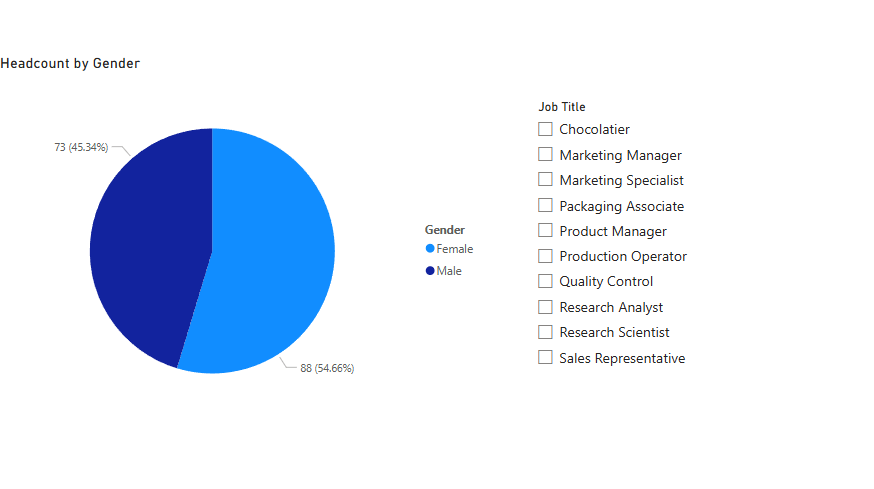
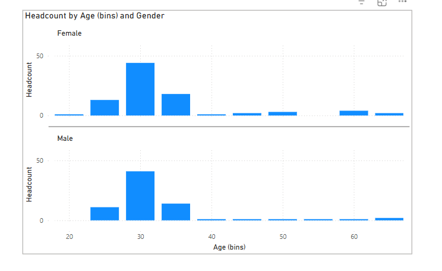
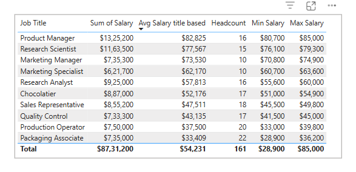
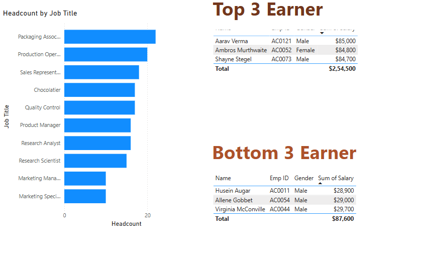
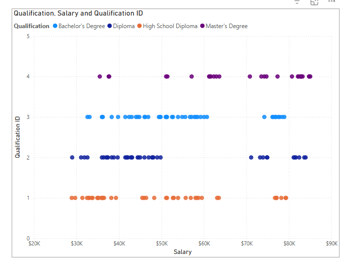
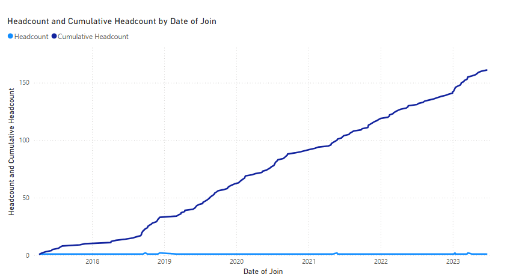
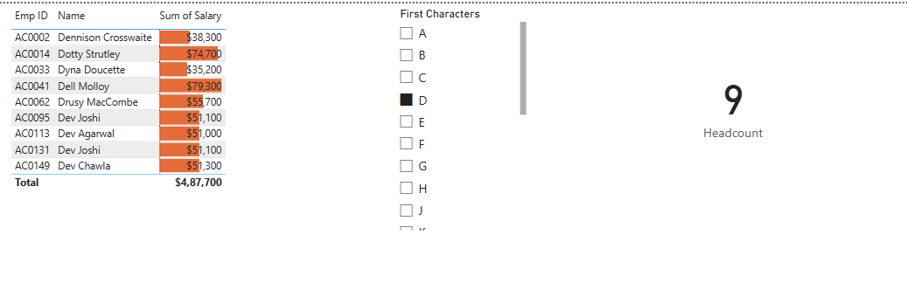
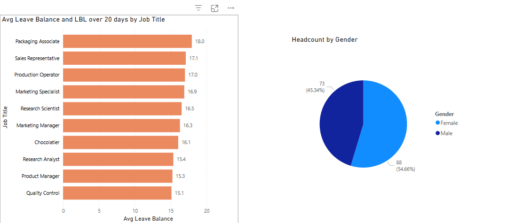

# HR Dashboard - Power BI Project

## 📊 Project Overview
This project is an interactive HR dashboard designed for a chocolate company to analyze and visualize employee-related metrics. It helps HR professionals gain insights into workforce demographics, salary trends, and staff growth.

## 🧰 Tools Used
- Power BI
- Microsoft Excel (Data Cleaning)
- Data Transformation (Power Query Editor)

## 📁 Dataset
The dataset contains employee information like age, salary, job role, gender, qualification, and more.

## 📌 Objectives Answered
1. How many people are in each job?

2. Gender break-down of the staff

3. Age spread of the staff

4. Which jobs pay more?

5. Top earners in each job

6. Qualification vs. Salary

7. Staff growth trend over time

8. Employee filter by starting letter

9. Leave balance analysis

## 🖼️ Dashboard Preview

## 📈 Insights
- Sales team has the largest headcount.
- Majority of high earners are in Management and Tech roles.
- Staff growth shows a positive trend over the last 2 years.
